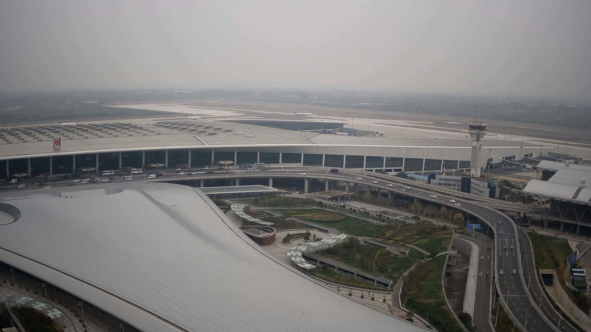
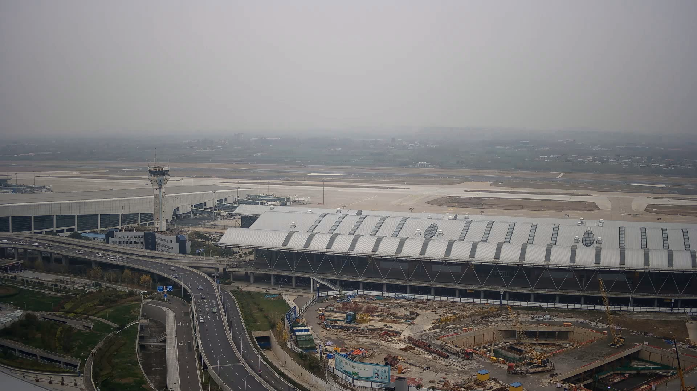
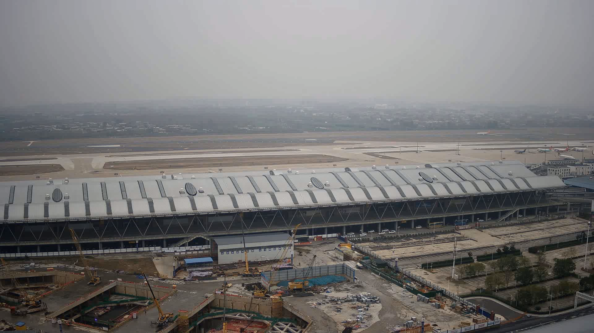

## 0x00 Intro

> This project is a simple implementation of opencv for the following papers.
>
> Du, Chengyao, et al. (2020). GPU based parallel optimization for real time panoramic video stitching. Pattern
> Recognition Letters, 133, 62-69.

Fast panorama stitching method using UMat.

Speed of 4 cameras at 4k resolution is greater than 200fps in 1080ti.

This project does not provide a dataset so it cannot be used out of the box.

一个使用 OpenCV 进行快速全景视频拼接的方法。通过巧妙的流并行策略，在 1080ti 上可以对 4k 视频进行超过 200fps 的图像拼接。

## 0x01 Quick Start

```
$ mkdir build && cd build
$ cmake ..
$ make
$ ./image-stitching
```

## 0x02 Known Issue

* **`Real FPS` is much slower than `FPS`**: `imwrite` takes a lot of time.
* **Stitching will never stop**: I didn't think about the way to use the dataset before, so I added a `dataset branch`. 
You can follow [this commit](https://github.com/duchengyao/gpu-based-image-stitching/commit/210fe9a17eb15a92f5d5eb9dc16d53605abbf44b) to modify your code. 
It will stop after stitching, but the program will not exit. The dataset `datasets/air-4cam-mp4` will generate 149 pictures.

Welcome to pull requests!

## 0x03 Example

> About these procedure below (chinese) http://s1nh.com/post/image-stitching-post-process/ .

| 00.mp4                    | 01.mp4                    | 02.mp4                    | 03.mp4                    |
|---------------------------|---------------------------|---------------------------|---------------------------|
|  |  |  |  |

stitching  


exposure-mask  


exposure-mask-refine  


apply-mask


final-panorama

